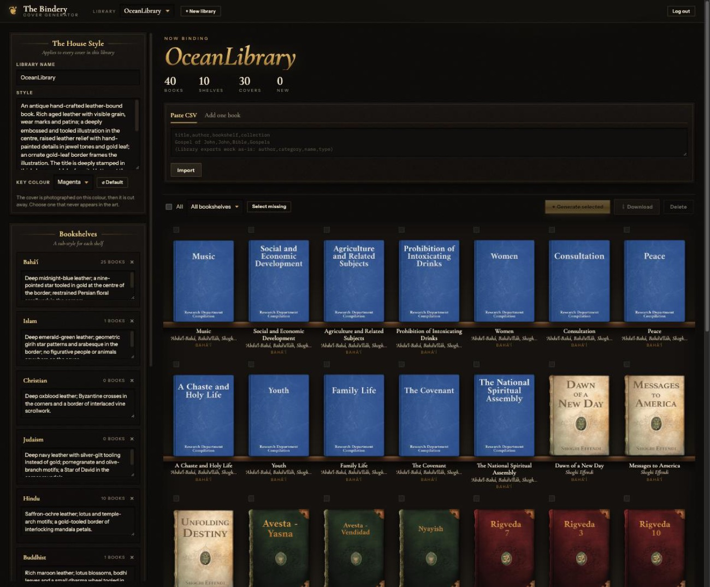
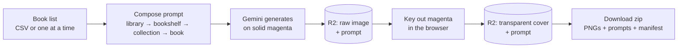
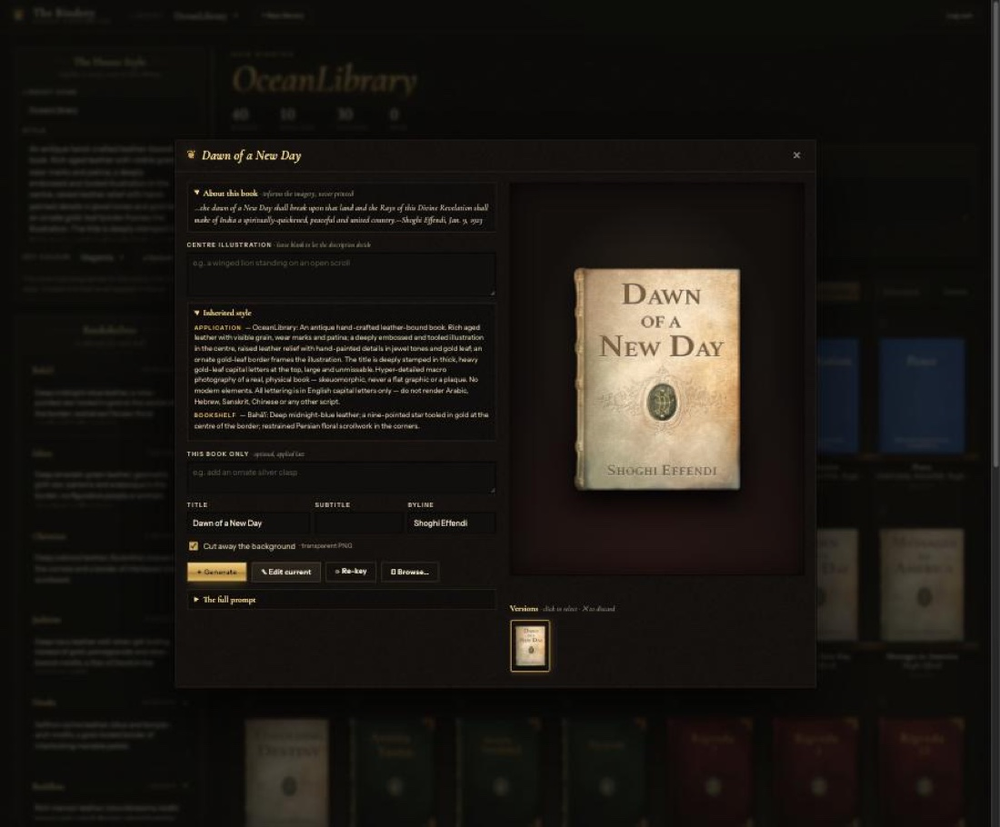

# Cover Generator

Generate consistent, photorealistic book covers for a whole library, with backgrounds that come out
cleanly transparent.

Paste a list of books, describe the look once at three levels (the whole library, each bookshelf,
each collection), and generate. Every cover comes back as a transparent PNG you can drop onto any page,
alongside the exact prompt that made it, so any single cover can be regenerated later.

**Live demo: [cover-generator.chadananda.workers.dev](https://cover-generator.chadananda.workers.dev)**
*(protected by a passcode, because every generation spends Gemini credit; ask Chad for it)*



> Proof of concept. It runs today and produces usable covers; the roadmap below lists what a
> production version would add.

---

## How a cover gets made



### 1. Describe the look in layers

A library's covers should feel like one collection and still tell each book apart. Style is stacked
from most general to most specific:

| Layer | Applies to | Example |
|---|---|---|
| **Application** | every cover in the set | antique hand-tooled leather, gold-leaf border, embossed centre |
| **Bookshelf** | one shelf, such as a tradition or genre | deep oxblood leather, Byzantine crosses in the corners |
| **Collection** | volumes that must match, such as the four Gospels | identical border; a roundel carries each evangelist's symbol |
| **Book** | one cover (optional) | add a silver clasp |

A collection also tells the model that its volumes must match one another in leather, border,
typography and layout, and differ only in title and centre illustration. That's how a multi-volume
set stays a set.

### 2. Book metadata guides the imagery

Each book's description and bookshelf go into the prompt as **context**: they guide the choice of
imagery and symbolism, and the prompt forbids printing them on the cover. If no centre illustration is
specified, the model chooses one that evokes the book's subject. Type one in the Image Manager to override that.

### 3. Generate on a key colour

The prompt asks for the book photographed from above on **solid magenta** (`#FF00FF`), with a
visible margin, no shadow and no vignette. Those requirements are stated at the start of the prompt
and repeated as a numbered list at the end, because the model drifts without the repetition.

<p align="center"></p>

### 4. Key out the background

Background removal is solved **at generation time**, not afterwards. Generic background removers
fail on leather: the worn edges fade gradually into the background, so there's no clean line to cut.
A colour that never appears in the art can be removed precisely. The keyer runs in four passes:

1. **Sample** the real background from the four corners. Don't assume pure `#FF00FF`, because the
   model adds vignetting.
2. **Flood-fill from every border pixel**, not just the corners, so magenta trapped in notches
   along the edge is reached too.
3. **Remove shadow**, repeating until nothing changes. A shadow on magenta keeps magenta's hue, so a
   plain colour-distance test misses it.
4. **Despill** the pink fringe, but keep those pixels **fully opaque**. Semi-transparent edges look
   chewed.

Then trim to the book and add a 12px transparent pad, so worn corners never touch the image edge.

<p align="center"></p>

*The same cover after keying, over a checkerboard and over black. The torn edges and spine are kept,
there's no pink fringe, and the lettering is solid.* On a real 896×1200 generation the keyer takes
about **0.1 seconds**.

Keying runs in your browser on the raw image saved in R2. Re-keying is free: it never pays for a new
generation. If a cover's proportions look wrong (cropped or mis-framed art), it's flagged so you can
regenerate it rather than fiddle with the cutout.

### 5. Refine one cover

Click any cover to open the **Image Manager** (modelled on NovelArabic's image editor):




- **Content prompt**: what the centre illustration shows ("a winged lion on an open scroll").
- **Inherited style**: the application, bookshelf and collection layers that apply, shown for reference.
- **Style override**: anything specific to this one book.
- **✦ Generate**: a new cover from the prompt.
- **✎ Edit**: change the *current* cover ("add an ornate silver clasp") instead of starting over.
- **⟳ Re-key**: run the background removal again on the saved raw image.
- **🖿 Browse…**: use an image from your computer.
- **Versions**: every render is kept. Click one to roll back, or ✕ to delete it.

### 6. Download

Select covers and click **Download selected** to get a zip containing:

```
gospel-of-mark-john.png    transparent cover
gospel-of-mark-john.txt    the exact prompt that made it
manifest.csv               file, title, author, bookshelf, collection
```

---

## Using the demo

The demo holds two libraries, each seeded with its **published** books (those live on the site today).
Every book that had a cover on the live site carries that cover as **version 1**, so you can compare the
current cover with a new one side by side.

| Library | Books | Bookshelves |
|---|---:|---|
| **OceanLibrary** | 457 | 10 traditions (Bahá'í, Islam, Christian, Hindu, Buddhist, …), each with its own leather and motifs |
| **WholeReader** | 586 | 9 genres (Short Stories, Novels, Children, Drama, …) in Victorian cloth bindings |

1. Open the [demo](https://cover-generator.chadananda.workers.dev) and enter the passcode.
2. Choose a library (one per application) or create a new one.
3. Add books:
   - **Paste CSV**: headers in any order or case. `title, author, bookshelf, collection` works, and so do
     common alternatives (`name`, `category`, `series`…). The Ocean library export
     (`author,category,name,type`) imports as-is. A headerless `title,author` paste works too.
     "Unknown" authors are dropped from the cover.
   - **Add one**: title, author, bookshelf, collection.
4. Write the **application style**, then give each bookshelf and collection its sub-style.
5. Open a book and **✦ Generate**. Tune the styles on single covers first; once the prompts are right,
   select many and **✦ Generate selected** (two at a time, ~20 seconds each).
6. Open any cover to refine it, then select and **Download**.

---

## Architecture

| Part | What it does |
|---|---|
| [`core/`](core/) | **All the cover logic, with zero dependencies**: prompt layering, the keyer, CSV import, the Gemini call. It runs unchanged in the browser, the Worker and Node. |
| [`src/worker.js`](src/worker.js) | Cloudflare Worker: passcode check, a Gemini proxy so the API key never reaches the browser, and R2 storage. |
| [`public/`](public/) | The page. Keying runs here, with the same `core/` code. |
| R2 bucket `cover-generator` | `project.json` per set, raw generations, keyed covers, and a `.json` prompt file beside every image. |

To reuse the generator without the app, copy [`core/`](core/). [`core/README.md`](core/README.md)
has a Node example.

---

## Development

```sh
npm install
npm test                          # 38 tests: keyer, prompt layering + metadata, CSV, Gemini client
cp .dev.vars.example .dev.vars    # add GEMINI_API_KEY and a PASSCODE
npm run dev                       # http://localhost:8787 (local R2)
```

`npm run dev` and `npm run deploy` first copy `core/` into `public/core/`, so the browser runs the same
files as the Worker and the tests. Always edit `core/`, never `public/core/`, and always deploy with
`npm run deploy` (a bare `wrangler deploy` would ship whatever stale copy is there).

## Deployment

The demo runs on Chad's personal Cloudflare account (`account_id` in [`wrangler.jsonc`](wrangler.jsonc)).

**One-time setup** (already done for the demo):

```sh
npx wrangler r2 bucket create cover-generator
npx wrangler secret put GEMINI_API_KEY
npx wrangler secret put PASSCODE
```

**Today** it's deployed by hand with `npm run deploy`.

**Next: deploy on every push.** Connect the repo with Cloudflare Workers Builds:

1. Cloudflare dashboard → **Workers & Pages** → `cover-generator` → **Settings** → **Builds** → **Connect**.
2. Choose GitHub repo `chadananda/cover-generator`, branch `main`.
3. Set the deploy command to `npm run deploy`, which copies `core/` into `public/core/` before deploying.

From then on, every commit to `main` deploys the demo. The secrets and the R2 bucket carry over,
because they belong to the Worker, not the build.

Optional: set a `GEMINI_MODEL` variable to override the default `gemini-3-pro-image-preview`.

---

## Roadmap

- **Accounts instead of a shared passcode** (e.g. Cloudflare Access), with per-user spend limits.
- **Batch jobs that run on the server**, so a 600-cover run doesn't need the browser tab open.
- **Automatic re-roll** when a cover fails the proportion check.
- **More style profiles**: WholeReader (Victorian cloth bindings, no tradition column) is next.

## Credits

The keying method is the *Book Cover Generation* recipe, proven first on CTAI.info. The Image
Manager follows the one in NovelArabic.

## License

MIT
